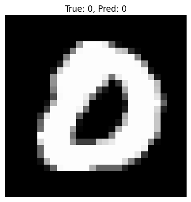
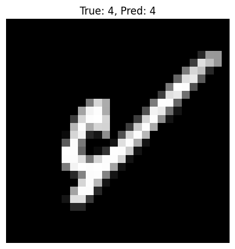
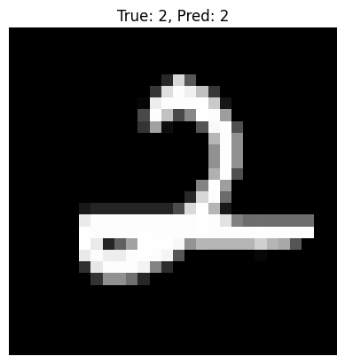
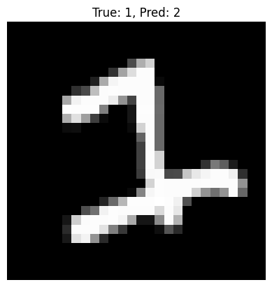
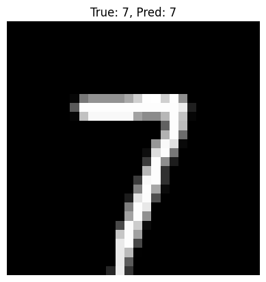

# Handwritten Digit Recognition with CNN (MNIST)

This project uses a **Convolutional Neural Network (CNN)** built with TensorFlow/Keras to classify handwritten digits (0–9) from the MNIST dataset.  
It achieves **~99% accuracy** on the test set.

---

## 📌 Project Structure
- `MNIST_Handwritten_Digit_Recognition(CNN).ipynb` → Google Colab/Jupyter notebook with full code.
- `mnist_cnn_model.h5` → Saved trained model (can be loaded without retraining).
- `requirements.txt` → Required Python libraries.
- `sample_predictions/` → Example predictions on test images.

---

## 🚀 How to Run
1. Clone the repository:
   ```bash
   git clone https://github.com/pritom5928/mnist-cnn-project.git
   cd mnist-cnn-project

## 📊 Results
- Training Accuracy: ~99%
- Test Accuracy: ~99%

Example predictions on test digits:

| Digit Image | Prediction |
|-------------|------------|
|  | 0 |
|  | 4 |
|  | 2 |
|  | 2 |
|  | 7 |


## 📚 Dataset
The project uses the [MNIST dataset](http://yann.lecun.com/exdb/mnist/), a standard benchmark dataset of handwritten digits.


